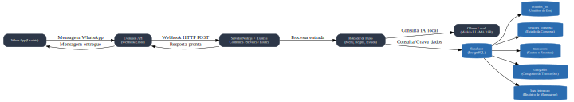

# Arquitetura do Bot Financeiro com Evolution API + Ollama + Supabase

Este documento descreve a arquitetura, tecnologias e estrutura de dados utilizadas no projeto **Bot Financeiro**, que integra **WhatsApp (via Evolution API)**, **Ollama Local** e **Supabase**.

## 📌 Visão Geral

O sistema recebe mensagens enviadas pelo usuário via WhatsApp, processa essas mensagens no servidor Node.js, decide a resposta com base nas regras de negócio e no contexto, podendo utilizar o **Ollama** como motor de IA local, e persiste dados no **Supabase**.

---

## 🛠 Tecnologias Utilizadas

- **Node.js + Express** – Servidor HTTP para recebimento do webhook da Evolution API e orquestração do fluxo.
- **TypeScript** – Tipagem estática e maior segurança no código.
- **Ollama (Local)** – Execução de modelos de linguagem, como LLaMA 3 8B, sem depender de APIs externas.
- **Supabase (PostgreSQL)** – Banco de dados para armazenamento de usuários, transações, sessões e logs.
- **Prisma ORM** – Acesso e manipulação tipada dos dados no banco.
- **Docker** – Containerização para facilitar execução e deploy.
- **Jest** – Testes unitários e de integração.

---

## 🔄 Fluxo de Funcionamento

1. **Usuário envia mensagem** no WhatsApp.
2. **Evolution API** encaminha a mensagem para o servidor Node.js via **webhook HTTP POST**.
3. O **Controller** correspondente recebe a requisição e aciona o **Service** de processamento.
4. O **Service** consulta o **Supabase** para buscar ou atualizar dados do usuário, categorias, transações e sessões.
5. Caso a resposta dependa de IA, o **Service** envia o prompt para o **Ollama Local** (`http://localhost:11434/api/chat`).
6. O resultado é enviado de volta para a Evolution API, que **entrega a resposta ao usuário** no WhatsApp.
7. Logs e contexto da conversa são armazenados no **Supabase** para auditoria e continuidade.

---

## 🗄 Estrutura do Banco de Dados (Supabase)

O banco foi projetado para suportar um bot financeiro com funcionalidades de controle de gastos e receitas.

Principais tabelas:

- **usuarios_bot** – Dados básicos do usuário, telefone, nome e status.
- **categorias** – Categorias de transações (gastos/receitas), podendo ser padrão ou personalizadas.
- **configuracoes_usuario** – Preferências como meta mensal, alertas, moeda e fuso horário.
- **transacoes** – Registro de gastos e receitas, com valor, categoria e data.
- **alertas** – Notificações automáticas, como metas atingidas e limites próximos.
- **sessoes_conversa** – Estado atual da conversa e contexto temporário.
- **logs_interacao** – Histórico detalhado de todas as interações com o bot.

---

## 📊 Diagrama de Arquitetura



**Legenda:**
- **Caixas cinzas** → Componentes do sistema.
- **Cilindros azuis** → Banco de dados ou tabelas.
- **Setas** → Fluxo de informações.

---

## 📂 Estrutura de Pastas Recomendada

```
src/
  config/          # Configurações (variáveis de ambiente, constantes)
  controllers/     # Entrada das requisições HTTP
  services/        # Regras de negócio e integração com APIs externas
  routes/          # Rotas HTTP (Express)
  middlewares/     # Interceptadores de requisições
  utils/           # Funções auxiliares
  models/          # Modelos de dados (Prisma ORM)
  database/        # Conexão e migrações
  integrations/    # Adapters para Evolution API, Ollama, etc.
  tests/           # Testes unitários e de integração
```

---

## 🚀 Diferenciais para Portfólio

- **Código modular e escalável**.
- **Tipagem forte** com TypeScript.
- **Integração com IA local** (sem depender de APIs externas).
- **Banco de dados estruturado com integridade referencial**.
- **Documentação e diagrama de arquitetura**.
- **Testes e linting configurados**.
- **Uso de Docker para padronizar ambiente**.

---

## 📅 Próximos Passos

- Implementar rotas do webhook da Evolution API.
- Criar services para integração com Ollama.
- Configurar ORM Prisma para mapear o Supabase.
- Implementar camada de testes.
- Criar pipeline de CI/CD.
