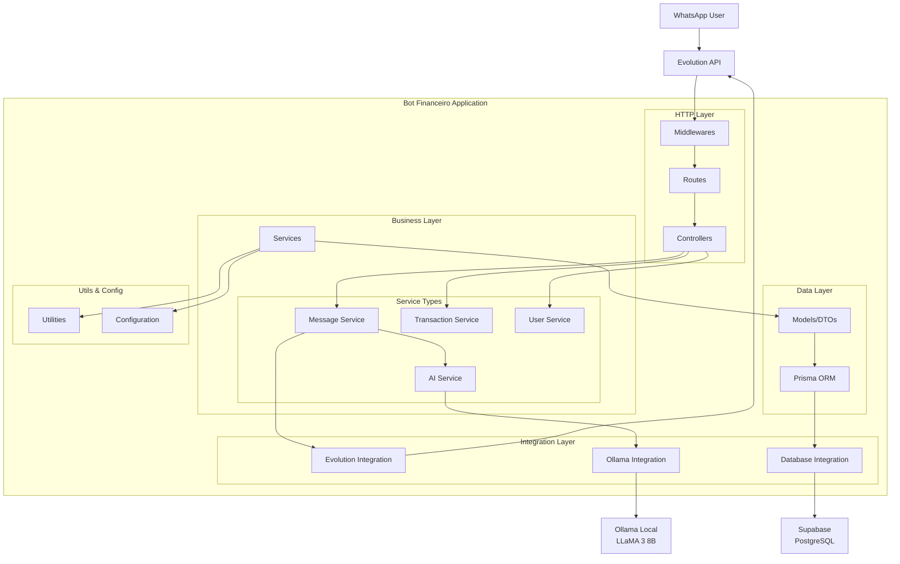
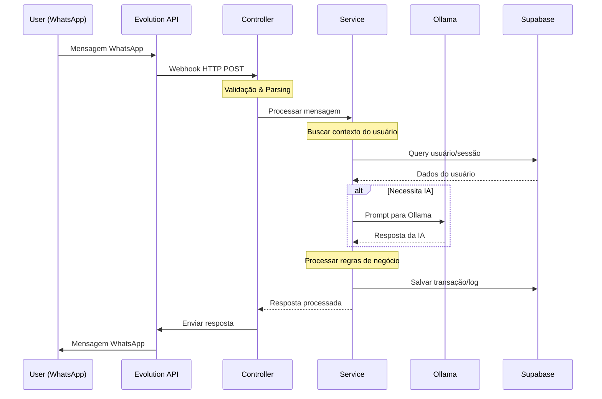
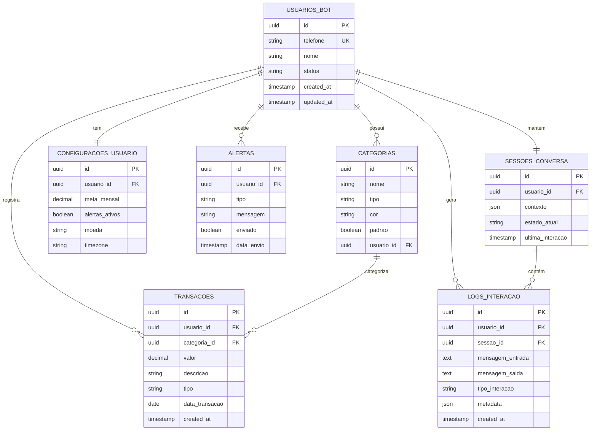

# Design da Arquitetura - Bot Financeiro

Este documento apresenta o design detalhado da arquitetura do **Bot Financeiro**, um sistema integrado que combina WhatsApp (via Evolution API), processamento de IA local (Ollama) e persistência de dados (Supabase).

## 🏗️ Visão Geral da Arquitetura

O sistema segue uma arquitetura em camadas com separação clara de responsabilidades, utilizando padrões como MVC e Repository Pattern para garantir manutenibilidade e escalabilidade.

## 📐 Diagrama de Componentes



## 🔄 Fluxo de Dados



## 🗄️ Modelo de Dados



## 🏛️ Arquitetura em Camadas

### 1. **Presentation Layer** (HTTP)
- **Middlewares**: Autenticação, validação, logging
- **Routes**: Definição de endpoints REST
- **Controllers**: Orchestration e validação de entrada

### 2. **Business Layer** 
- **Services**: Regras de negócio e orquestração
  - `MessageService`: Processamento de mensagens
  - `TransactionService`: Gerenciamento de transações
  - `UserService`: Operações de usuário
  - `AIService`: Integração com IA

### 3. **Data Access Layer**
- **Models/DTOs**: Estruturas de dados tipadas
- **Prisma ORM**: Mapeamento objeto-relacional
- **Repository Pattern**: Abstração de acesso a dados

### 4. **Integration Layer**
- **Evolution Integration**: Cliente para API do WhatsApp
- **Ollama Integration**: Cliente para IA local
- **Database Integration**: Conexões e transações

## 🔧 Tecnologias e Padrões

### Stack 
- **Runtime**: Node.js 18+
- **Language**: TypeScript
- **Framework**: Express.js
- **ORM**: Prisma
- **Database**: PostgreSQL (Supabase)
- **AI**: Ollama (LLaMA 3 8B)
- **Messaging**: Evolution API (WhatsApp)
- **Containerization**: Docker
- **Testing**: Jest

### Padrões Arquiteturais
- **MVC** (Model-View-Controller)
- **Repository Pattern** para acesso a dados
- **Service Layer** para regras de negócio
- **Dependency Injection** para desacoplamento
- **Event-Driven** para operações assíncronas

## 📁 Estrutura de Diretórios

```
src/
├── config/                 # Configurações de ambiente
│   ├── database.ts
│   ├── ollama.ts
│   └── evolution.ts
├── controllers/            # Controllers HTTP
│   ├── webhook.controller.ts
│   └── health.controller.ts
├── services/              # Lógica de negócio
│   ├── message.service.ts
│   ├── transaction.service.ts
│   ├── user.service.ts
│   └── ai.service.ts
├── repositories/          # Acesso a dados
│   ├── user.repository.ts
│   ├── transaction.repository.ts
│   └── session.repository.ts
├── integrations/          # Integrações externas
│   ├── evolution/
│   │   ├── client.ts
│   │   └── types.ts
│   ├── ollama/
│   │   ├── client.ts
│   │   └── prompts.ts
│   └── database/
│       └── connection.ts
├── models/               # DTOs e Types
│   ├── user.model.ts
│   ├── transaction.model.ts
│   └── message.model.ts
├── middlewares/          # Middlewares Express
│   ├── auth.middleware.ts
│   ├── validation.middleware.ts
│   └── error.middleware.ts
├── routes/               # Definição de rotas
│   ├── webhook.routes.ts
│   └── health.routes.ts
├── utils/                # Utilitários
│   ├── logger.ts
│   ├── validator.ts
│   └── formatter.ts
└── tests/               # Testes
    ├── unit/
    ├── integration/
    └── e2e/
```

## 🔐 Considerações de Segurança

1. **Autenticação**: Webhook tokens para validar origem
2. **Validação**: Sanitização de entrada de dados
3. **Rate Limiting**: Controle de frequência de requisições
4. **Logging**: Auditoria completa de operações
5. **Isolamento**: Containers separados para cada serviço

## 📊 Métricas e Monitoramento

- **Health Checks**: Endpoints de saúde para cada serviço
- **Logging Estruturado**: Winston com níveis de log
- **Métricas de Performance**: Tempo de resposta, throughput
- **Alertas**: Notificações automáticas para falhas

## 🚀 Escalabilidade

- **Horizontal**: Load balancer para múltiplas instâncias
- **Vertical**: Otimização de recursos por container
- **Cache**: Redis para sessões e dados frequentes
- **Queue**: Sistema de filas para processamento assíncrono

---

Este design fornece uma base sólida para desenvolvimento, manutenção e evolução do Bot Financeiro, seguindo as melhores práticas de arquitetura de software.